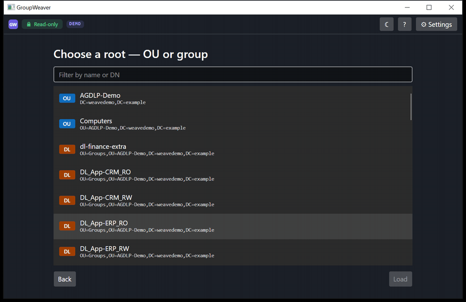

# GroupWeaver

[](https://github.com/Atrono/GroupWeaver/actions/workflows/ci.yml)

GroupWeaver is a Windows desktop app that visualizes existing Active Directory
structures as an interactive graph (AD at the center, objects and nestings around
it) and audits them against the AGDLP principle and configurable naming
conventions. Where security-path tools like BloodHound or Adalanche show attack
paths, GroupWeaver shows structural cleanliness and convention adherence — a
governance perspective, not a security one.



*Exploring in demo mode: pick a group as the root, click a node to inspect it in
the detail panel, double-click the dashed frontier node to lazy-expand its
members — all against the bundled fictional dataset.*

> **Pre-release.** GroupWeaver is in active early development; there is no
> release yet. See [Status](#status).

## What GroupWeaver does NOT see

GroupWeaver audits the **A-G-DL structure and naming conventions** — not the
permission grants themselves. The "P" in AGDLP, the actual assignment of rights
via resource ACLs (file servers, shares, etc.), lives outside the AD object
model and is invisible to the tool. ACL/file-server scanning is **permanently
out of scope** — that would be a different product.

## Read-only guarantee

The app **never writes to Active Directory**. There is no code path for write
operations of any kind. It runs in the logged-on user's security context
(Integrated Authentication) — no credential handling, no stored secrets.

## Status

Early development (Phase 1 of the [project plan](PLANNING.md), German;
architecture decisions in [docs/adr/](docs/adr/)). Planned scope for v0.1:

- Live LDAP connection (read-only, user context) plus a demo mode
- Entry filter: pick a base OU or group as the graph root
- Interactive graph: node types, nesting edges, lazy expand, drag/zoom
- Detail panel showing object attributes — restricted to an explicit
  attribute whitelist (the privacy baseline)
- Rule engine: nesting-matrix and naming checks with traffic-light badges
  (plus circularity and empty-group detection)
- Settings page with rule editor (live preview, import/export)

## Demo mode

Full functionality against a bundled, fictional dataset — no Active Directory
needed:

```
GroupWeaver --demo
```

All screenshots and GIFs published for this project are produced in demo mode
only — never against a real directory.

## System requirements

- Windows 10 / Windows Server 2016 or later
- .NET 8 runtime (a self-contained portable .zip is planned, so no separate
  install will be required)
- [WebView2 Evergreen Runtime](https://developer.microsoft.com/microsoft-edge/webview2/)
  (preinstalled on current Windows 10/11; absent on some Server SKUs)

## Building from source

Requires the .NET 8 SDK and PowerShell 7 (`pwsh`):

```
pwsh tools/build.ps1
```

This runs restore, build, format verification, and tests.

## Verifying your download

Coming with v0.1: releases will ship as a portable .zip with published SHA256
hashes and GitHub build provenance attestations.

## License

[MIT](LICENSE) — © Atrono. Third-party components are listed in
[THIRD-PARTY-NOTICES.md](THIRD-PARTY-NOTICES.md).
