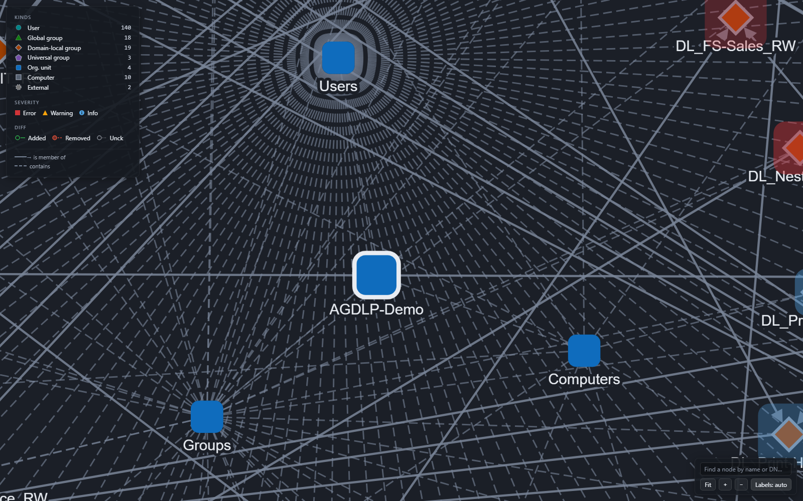
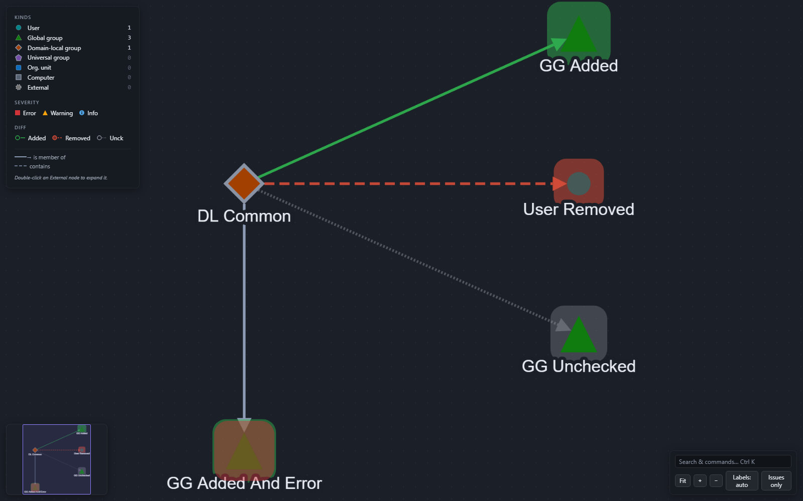

# GroupWeaver

[](https://github.com/Atrono/GroupWeaver/actions/workflows/ci.yml)

GroupWeaver is a Windows desktop app that visualizes existing Active Directory
structures as an interactive graph (AD at the center, objects and nestings around
it) and audits them against the AGDLP principle and configurable naming
conventions. Where security-path tools like BloodHound or Adalanche show attack
paths, GroupWeaver shows structural cleanliness and convention adherence — a
governance perspective, not a security one.



*Exploring the bundled demo directory in demo mode: object kinds (user, global /
domain-local / universal group, OU, computer, external) are distinct by both color
and shape, nesting is drawn as directed edges, and a legend sits top-left.*



*Gap analysis diffs a proposed plan against the live structure: added objects and
memberships read green, removed read red-orange and dashed, and known-but-unexpanded
areas read gray and dotted — a node's kind and any rule findings still show through.*

## What GroupWeaver does NOT see

GroupWeaver audits the **A-G-DL structure and naming conventions** — not the
permission grants themselves. The "P" in AGDLP, the actual assignment of rights
via resource ACLs (file servers, shares, etc.), lives outside the AD object
model and is invisible to the tool. ACL/file-server scanning is **permanently
out of scope** — that would be a different product.

## Read-only guarantee

The app **never writes to Active Directory**. There is no code path for write
operations of any kind. It runs in the logged-on user's security context
(Integrated Authentication) — no credential handling, no stored secrets.

## Status

**v0.3.0 is the latest public release** — it adds in-graph navigation (find any
node by name or DN, zoom / fit / all-labels controls) and a distraction-free
**focus mode** with full-screen and an adjustable, collapsible panel rail, on top
of the v0.2 feature set (plan mode, gap analysis, export) and the v0.2.1 polish
pass (crafted motion, selection feedback, WCAG 2.2 AA). It also fixes a
back-navigation crash and hardens the naming-rule preview (see the
[project plan](PLANNING.md), German; architecture decisions in
[docs/adr/](docs/adr/)). GroupWeaver offers:

**Explore the live structure**

- Live LDAP connection (read-only, user context) plus a demo mode
- Entry filter: pick a base OU or group as the graph root
- Interactive graph: node types, nesting edges, lazy expand, drag/zoom/fit,
  find any node by name or DN, and an all-labels toggle
- Adjustable, collapsible panel rail plus a distraction-free **focus mode**
  (press `F`, or `F11` for full-screen) that folds the chrome away for presenting
- Detail panel showing object attributes — restricted to an explicit
  attribute whitelist (the privacy baseline)
- Rule engine: nesting-matrix and naming checks with traffic-light badges
  (plus circularity and empty-group detection), a findings sidebar with
  jump-to-node, and an honest "unexpanded areas are unchecked" caveat
- Settings page with rule editor (live preview, matrix editor, import/export)

**Plan and compare** (v0.2)

- **Plan mode** — author a proposed structure (groups, users, memberships); the
  same rule engine validates it live as you edit
- **Gap analysis** — diff a plan against the live structure: added / removed /
  unchecked cues in the graph plus a "Changes" sidebar
- **Export** — findings report as CSV or self-contained HTML, the graph as a PNG,
  and a plan as an **inert** PowerShell script (for human review — GroupWeaver
  never runs it and never writes to AD)

## Demo mode

Full functionality against a bundled, fictional dataset — no Active Directory
needed:

```
GroupWeaver --demo
```

All screenshots and GIFs published for this project are produced in demo mode
only — never against a real directory.


*Picking a root, inspecting a node, lazy-expanding an unresolved group into its
members, zooming the AGDLP-Demo structure, then pressing **F** for focus mode — the
panels fold away and the graph fills the window. Entirely in demo mode.*

## Rulesets

The rule engine is driven by a single JSONC rule file. The built-in default
(strict AGDLP, `GG_`/`DL_`/`UG_` naming, well-known principals ignored) is
embedded in the app — no file needed. To customize, place a complete ruleset
at `%APPDATA%\GroupWeaver\ruleset.jsonc`; it replaces the default outright
(no merging). Commented examples, including a published copy of the default,
live in [examples/rulesets/](examples/rulesets/); the format is specified in
[ADR-008](docs/adr/008-rule-model.md).

## System requirements

- **Windows 10 / Windows Server 2016 or later** (x64).
- **No .NET install required.** The portable `.zip` is self-contained — the
  .NET 8 runtime is bundled inside `GroupWeaver.App.exe`.
- **[WebView2 Evergreen Runtime](https://developer.microsoft.com/microsoft-edge/webview2/)**
  — required, and **not** bundled in the `.zip` (it is a shared, auto-updating
  system component). Preinstalled on current Windows 10/11; absent on some
  Windows Server SKUs. If it is missing, GroupWeaver shows a banner with a
  download link on launch — install the **Evergreen Standalone Installer** and
  restart the app.

> **First-run SmartScreen note.** GroupWeaver is not code-signed (it is a free,
> open-source project without a certificate). Windows SmartScreen may show
> "Windows protected your PC" the first time you run the `.exe`. Verify the
> download first (below), then choose **More info → Run anyway**. Integrity and
> origin are guaranteed by the published SHA256 hash and the GitHub build
> provenance attestation, not by a signing certificate.

## Building from source

Requires the .NET 8 SDK and PowerShell 7 (`pwsh`):

```
pwsh tools/build.ps1
```

This runs restore, build, format verification, and tests.

## Verify your download

Every release ships a portable `.zip`, a `.sha256` sidecar, and a GitHub build
provenance attestation. There is no code-signing certificate (see the SmartScreen
note above); instead, verify integrity and origin yourself — two commands.

**1. Check the SHA256 hash** against the value in the release notes / the
`GroupWeaver-0.3.0-win-x64.zip.sha256` sidecar:

```powershell
Get-FileHash .\GroupWeaver-0.3.0-win-x64.zip -Algorithm SHA256
```

**2. Verify build provenance** with the [GitHub CLI](https://cli.github.com/) —
this cryptographically confirms the `.zip` was built by this repository's release
workflow on GitHub's runners, not repackaged by someone else:

```powershell
gh attestation verify .\GroupWeaver-0.3.0-win-x64.zip --repo Atrono/GroupWeaver
```

A passing check prints the matched attestation and the workflow that produced it.

## License

[MIT](LICENSE) — © Atrono. Third-party components are listed in
[THIRD-PARTY-NOTICES.md](THIRD-PARTY-NOTICES.md).
